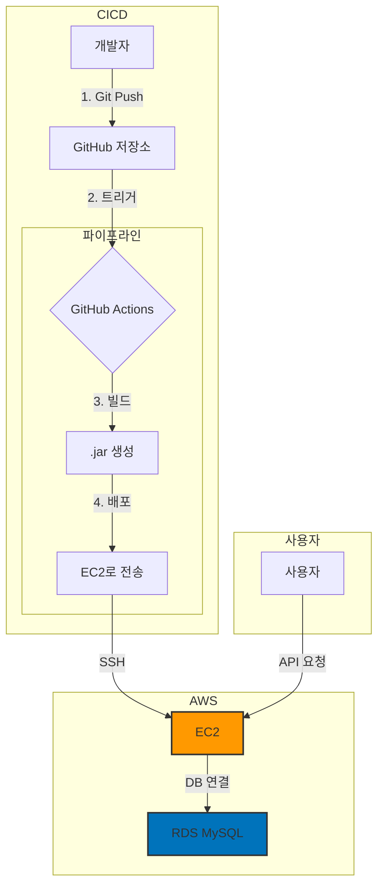

# 이커머스 API (Backend Portfolio)

## 1. 프로젝트 소개

실제 운영 및 확장성을 고려하여 설계한 이커머스 API입니다.

이 프로젝트는 단순히 상품을 판매하는 API를 구현하는 것을 넘어 신입 개발자로서 마주할 수 있는 과제들을 해결하기 위해 집중했습니다. **안전한 사용자 인증 시스템 구축, 데이터 무결성을 보장하는 트랜잭션 관리, 클라우드 인프라 설계, 그리고 수많은 트러블슈팅을 거친 CI/CD 파이프라인 구축** 등 백엔드 엔지니어의 핵심 역량을 고민했습니다.

---

### ✨ **API Docs**

- **[API Documentation (Swagger)](http://3.34.46.39:8081/swagger-ui/index.html)**

---

## 2. 주요 기능

- **🔐 사용자 인증**: JWT(JSON Web Token)와 Spring Security를 이용한 안전한 API 기반 회원가입 및 로그인 기능을 제공합니다.
- **📦 상품 관리**: 관리자와 일반 사용자의 권한을 분리하여 관리자만 상품을 등록, 수정, 삭제할 수 있는 기능을 구현했습니다.
- **🛒 장바구니**: 로그인한 사용자가 원하는 상품을 담고, 수량을 변경하고, 삭제하는 등의 장바구니 기능을 제공합니다.
- **💳 주문 및 결제**: 장바구니의 상품들을 기반으로 주문을 생성하고, 사용자의 내부 포인트를 이용한 결제 시뮬레이션 기능을 구현했습니다.

## 3. API 명세

### **User API**

| 기능 | HTTP Method | URL | 설명 |
| :--- | :--- | :--- | :--- |
| 회원가입 | `POST` | `/api/users/signup` | 새로운 사용자 등록 |
| 로그인 | `POST` | `/api/users/login` | 이메일, 비밀번호로 로그인 후 JWT 발급 |

### **Product API**

| 기능 | HTTP Method | URL | 설명 |
| :--- | :--- | :--- | :--- |
| 상품 생성 | `POST` | `/api/products` | 새로운 상품 등록 (ADMIN 권한 필요) |
| 상품 상세 조회 | `GET` | `/api/products/{productId}` | 특정 상품의 상세 정보 조회 |
| 상품 목록 조회 | `GET` | `/api/products` | 모든 상품 목록 페이징 조회 |
| 상품 정보 수정 | `PUT` | `/api/products/{productId}` | 특정 상품의 정보 수정 (ADMIN 권한 필요) |
| 상품 삭제 | `DELETE` | `/api/products/{productId}` | 특정 상품 삭제 (ADMIN 권한 필요) |

### **Cart API**

| 기능 | HTTP Method | URL | 설명 |
| :--- | :--- | :--- | :--- |
| 장바구니 상품 추가 | `POST` | `/api/cart/items` | 내 장바구니에 상품 추가 |
| 내 장바구니 조회 | `GET` | `/api/cart` | 내 장바구니의 모든 상품 조회 |
| 장바구니 상품 수량 변경 | `PATCH` | `/api/cart/items/{cartItemId}` | 장바구니 내 특정 상품의 수량 변경 |
| 장바구니 상품 삭제 | `DELETE` | `/api/cart/items/{cartItemId}` | 장바구니에서 특정 상품 제거 |

### **Order API**

| 기능 | HTTP Method | URL | 설명 |
| :--- | :--- | :--- | :--- |
| 주문 생성 | `POST` | `/api/orders` | 장바구니의 모든 상품으로 새로운 주문 생성 |
| 내 주문 목록 조회 | `GET` | `/api/orders` | 내 모든 주문 내역 페이징 조회 |
| 주문 상세 조회 | `GET` | `/api/orders/{orderId}` | 내 특정 주문의 상세 내역 조회 |
| 주문 취소 | `POST` | `/api/orders/{orderId}/cancel` | 내 특정 주문 취소 |

### **Payment API**

| 기능 | HTTP Method | URL | 설명 |
| :--- | :--- | :--- | :--- |
| 내부 포인트 결제 | `POST` | `/api/payments/internal/{orderId}` | 내부 포인트를 사용한 주문 결제 처리 |

 

## 4. 적용 기술 및 개발 환경

- **Backend**: `Java 21`, `Spring Boot 3.x`, `Spring Security`, `Spring Data JPA`
- **Database**: `MySQL`
- **Build Tool**: `Gradle`
- **Infrastructure & DevOps**: `GitHub Actions`, `AWS EC2`, `AWS RDS`

## 5. 전체 시스템 아키텍처

<b>클릭하여 아키텍처 확인하기</b>

개발부터 배포, 서비스 운영까지의 전체 흐름을 나타내는 아키텍처 다이어그램입니다.

## 6. 테스트 가이드

- **테스트 계정 (ADMIN)**: `admin@admin.com` / `admin`
  - 애플리케이션 시작 시 자동으로 생성되는 관리자 계정입니다.
  - 이 계정으로 로그인하여 상품 등록 등 관리자 전용 API를 테스트할 수 있습니다.

- **초기 데이터**: 
  - **상품**: `testProduct` (price: 1000, stock: 1000)가 기본으로 생성되어 있습니다.
  - **포인트**: 모든 사용자는 회원가입 시 **1,000,000 포인트**가 기본으로 지급되어, 충분한 결제 테스트가 가능합니다.

- **테스트 방법**:
  1.  `/api/users/login` API를 통해 로그인하고 `accessToken`을 발급받습니다.
  2.  인증이 필요한 API는 HTTP 요청 헤더에 `Authorization: Bearer {accessToken}`을 포함하여 호출합니다.
